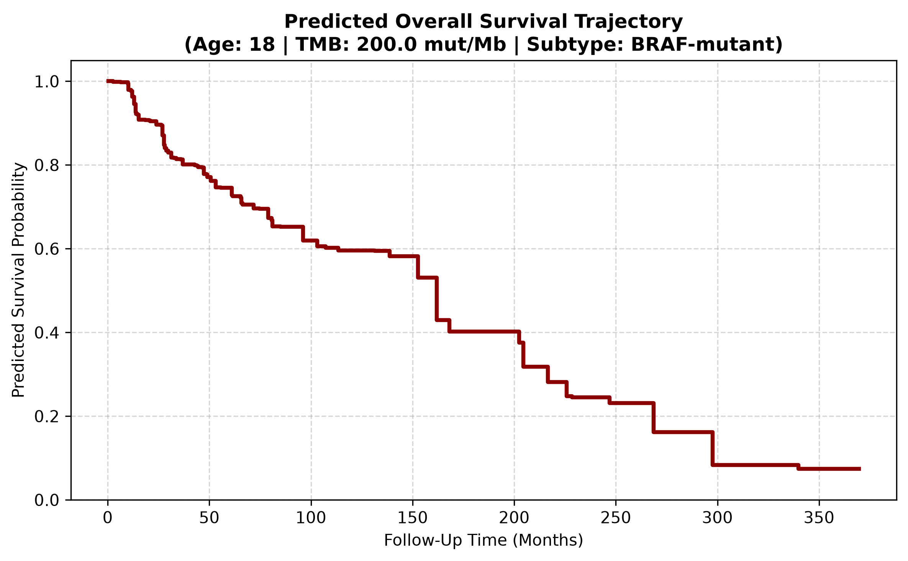

# Stratified Tumor Mutational Burden (TMB) & Survival Analysis in TCGA Melanoma

An end-to-end computational biology pipeline investigating driver mutation status (*BRAF*, *NRAS*), Tumor Mutational Burden (TMB), and overall survival in Skin Cutaneous Melanoma using TCGA Firehose Legacy data via cBioPortal.

---

## Key Visualizations

### Predicted Individual Patient Survival Trajectory

---

## Executive Summary

In this project, I go from conducting exploratory distribution profiling to non-parametric Kaplan-Meier survival modeling, predictive Random Survival Forest (RSF) machine learning, and an interactive console-based patient survival simulation tool with clinical input validation.

### Biological Insights & Model Performance
* **Driver Stratification (*BRAF* vs. *NRAS* vs. Wild-Type):** *NRAS*-mutant tumors exhibited the highest median TMB (~13 mut/Mb), followed by *BRAF*-mutants (~9–10 mut/Mb), and Wild-Type (~2–3 mut/Mb).
* **Kaplan-Meier Survival Divergence:** High-TMB patients showed a statistically significant overall survival benefit ($p = 0.0018$, Log-Rank Test), supporting immunogenic neoantigen mechanisms.
* **Random Survival Forest Modeling:** I trained an ensemble RSF accounting for heavy right-censoring using scikit-survival. In doing so, I achieved a testing Concordance Index (C-Index) of 0.6280.

---

## Technical Features
* **Clinical Input Validation:** The console predictor enforces realistic biological limits for age (18–100 years) and TMB (0.1–200.0 mut/Mb) to prevent out-of-distribution inference errors.
* **Automated Plot Exports:** File system handling dynamically manages local directory structures for minimal plot export issues.

---

## Tech Stack
* **Language:** Python
* **Libraries:** pandas, numpy, lifelines, scikit-survival, seaborn, matplotlib
* **Data Source:** [cBioPortal for Cancer Genomics](https://www.cbioportal.org/) (TCGA Firehose Legacy)
